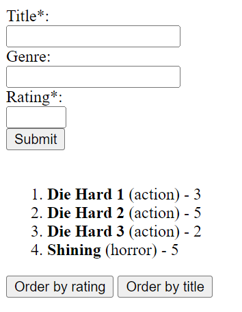
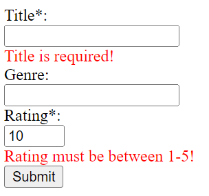
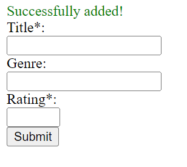
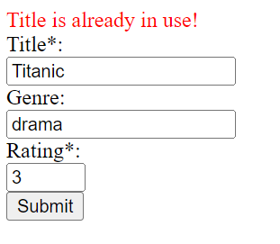

# MOVIE TRACKER

We are going to create a movie tracker application.
The app must store the following information about the movies:
- Title (unique)
- Genre (can be unknown, but not null)
- Rating (integer between 1-5)


## GET `/`

The following component must be rendered.



The user must provide the following information:
- title
- rating

The user may provide the following information:
- genre

The form must be validated before submitting: if the title or the rating is missing or the rating is smaller than 1 or bigger than 5 display the error messages below the appropriate input fields.



The form must be submitted to **POST `/api/movies`**. If the request was successful it must display a positive message above the form like **“Successfully added”** and clear the input fields.



Otherwise, if the title is already used display the message from the response.



Below the form you must display the movies from the database in the following format: `<title> (<genre>) - <rating>` in an ordered list. The movies are ordered by title by default.
Clicking on the `Order by rating` or `Order by title` buttons the list must be ordered ascending by request.


## GET `/api/movies`

This endpoint should
- receive the required ordering (title or rating) as a query string parameter
- example query: `http://localhost:3000/api/movies?order=title`
- return all the users in the following format ordered by the requested parameter:
```json
[
    
    {
        "title": "Die Hard 1",
        "genre": "action",
        "rating": 3
    },
    {
        "title": "Die Hard 2",
        "genre": "action",
        "rating": 5
    },
        …
]

```


## POST `/api/movies`
 
This endpoint should handle the incoming requests.
- receive the content of the input fields in the request body, for example:
```json
{
    "title": "Die Hard 1",
    "genre": "action",
    "rating": 3
}
```
- if the genre is empty `"unknown"` should be inserted into the database
- the rating cannot be smaller than 1 or bigger than 5

If the adding was successful the response must have `201 Created` status code and send back the created entry in this format:
```json
{
	"id": 3,
	"title": "Die Hard 1",
	"genre": "action",
	"rating": 3
}
```
Otherwise, it must have `400 Bad Request` and a descriptive message like **“Title is already in use!”** or **“Rating must be between 1-5!”**.

The frontend should append the new movie to the existing list of movies.


