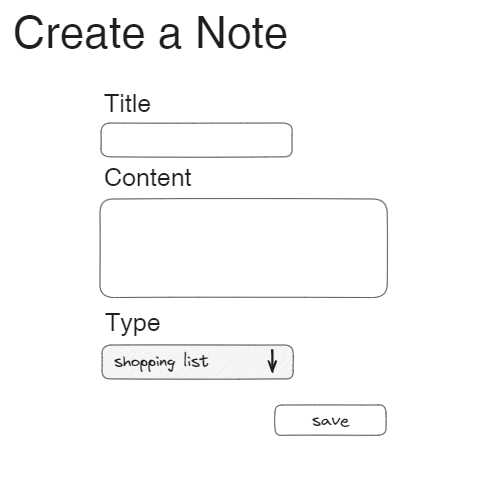
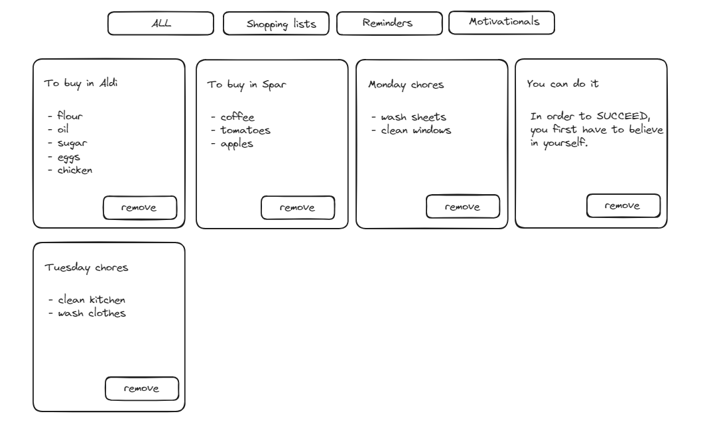

# Notes app

The application is a basic note-taking system that allows users to create and manage their notes. It consists of a front-end interface with two pages: a form page for creating new notes and a list page for displaying existing notes.

## `GET /notes-form`

- It should render the form page
- It should contain a form with:
  - an input field for the title,
  - a textarea for the content of the note,
  - and a dropdown list for the type of note.



- The types should be:
  - shopping list
  - reminder
  - motivational
- The form should be submitted to `POST /api/note`
- After successful submission clear the form and display the "New note was saved."

## `GET /notes-main`

- It should render the notes page
- It should have two parts
- A header with 4 buttons
- and the main part with the notes displayed on cards
  - On each card, there is a button with the "remove" text
  - The remove button will fetch data from the `DELETE /note/{id}` endpoint
  - Clicking the remove will also delete the card from the main part
- Clicking on the `All` button should render all the notes
- Clicking the other three buttons should fetch the data from the `GET /note?type=[string]` endpoint



## `GET /api/notes`

- It should respond with a list of notes in JSON format.

```json
[
  {
    "title": "To buy in Aldi",
    "content": "- flour\n- oil\n- sugar\n- eggs\n- chicken"
  },
  {
    "title": "You can do it",
    "content": "In order to SUCCEED, you first have to believe in yourself."
  }
]
```

## `POST /api/note`

- First, it should save the new note in the database,
  then it should respond with a note in the following JSON format.

```json
{
  "id": 3,
  "title": "Monday chores",
  "content": "- wash sheets\n- clean windows",
  "type": "reminder"
}
```

## `GET  /api/note?type=[string]`

- It should return a list of notes based on the `type` query string in the URL.
- In case of invalid type the endpoint should return with `400` status code
  and the following object:

```json
{
  "error": "[string] type is not existing"
}
```

- Pay attention that the `type` query string is required.
- `GET /api/note?type=reminder` should return:

```json
[
  {
    "id": 3,
    "title": "Monday chores",
    "content": "- wash sheets\n- clean windows",
    "type": "reminder"
  },
  {
    "id": 5,
    "title": "Tuesday chores",
    "content": "- clean kitchen\n- wash clothes",
    "type": "reminder"
  }
]
```

## `DELETE /api/note/{id}`

- First, the endpoint should delete the note using the id from the path
- If the id does not exist return with a `400` status code
- In case of deleting a shopping list or reminder type the endpoint should
  return the content in the body:

```json
{
  "content": "- coffee\n- tomatoes\n- apples"
}
```

## SQL

Given the following table named `customers`

| customer_id | customer_name |
| :---------- | :------------ |
| 1           | John Doe      |
| 2           | Jane Smith    |
| 3           | David Johnson |

Given the following table named `orders`

| order_id | order_name | customer_id |
| :------- | :--------- | :---------- |
| 1        | Order 1    | 1           |
| 2        | Order 2    | 1           |
| 3        | Order 3    | 2           |
| 4        | Order 4    | 3           |
| 5        | Order 5    | 3           |

`1.` Write SQL query to get all the customer names without an order.

```sql

```

`2.` Write SQL query to insert a new order.

```sql

```

`3.` Write SQL query to update specific customer name.

```sql

```
